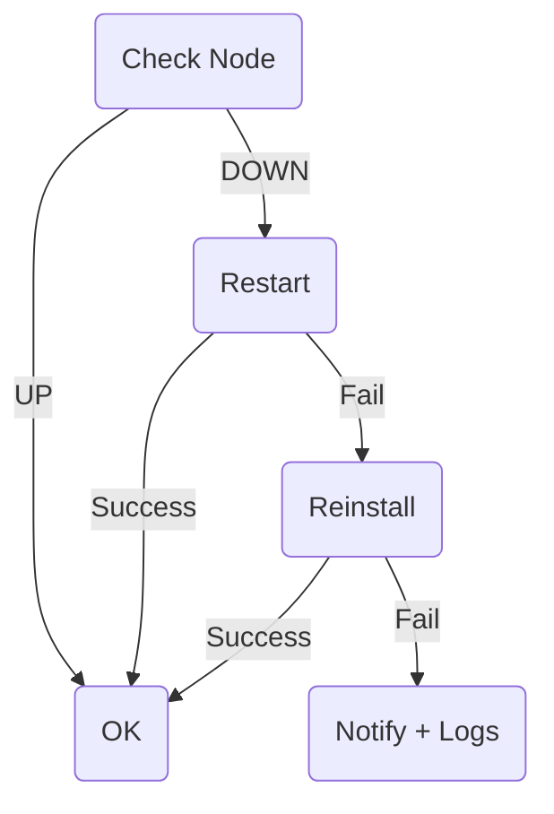

<START>

<!-- BANNER -->
<p align="center">
  
</p>

<h1 align="center">⚡ Deklan Node Bot — v3.6</h1>
<p align="center">
  Telegram Control Panel + Auto-Monitor + Swap Manager + One-Click Installer
</p>

<p align="center">
  
  
  
  
  
</p>

---

## 🧠 Overview

**Deklan Node Bot** = Telegram bot untuk kontrol & monitoring  
**Gensyn RL-Swarm Node TANPA SSH**

✅ Start / Stop / Restart  
✅ CPU / RAM / Disk / Uptime  
✅ Logs → Telegram  
✅ Latest Round  
✅ Auto-Monitor + Auto-Restart  
✅ Auto-Reinstall  
✅ Swap Manager (16G / 32G / 64G / Custom)  
✅ One-Click Installer  
✅ Danger Zone (password)  
✅ Multi admin  
✅ AUTO_INSTALLER → update script remote  
✅ No-spam UP/DOWN  
✅ Interactive .env prompt saat install  

> Semua cukup dari Telegram HP 📱

---

## ✨ Features

- Full interactive Telegram menu
- Systemd integration
- Auto-Monitor (timer)
- Auto-Restart + Auto-Reinstall
- CPU/RAM/Disk Monitoring
- Dynamic Round tracking
- Log viewer (journalctl)
- Swap Manager
- Multiple admin support
- Remote installer integration
- Danger Zone (Hard cleanup)
- No spam alert (state cached)

---

# 🚀 Quick Install

> Jalankan di VPS

```bash
bash <(curl -s https://raw.githubusercontent.com/deklan400/deklan-node-bot/main/install.sh)
```

Installer otomatis:
✅ Install dependencies  
✅ Clone repo  
✅ Setup virtualenv  
✅ Tanya BOT_TOKEN + CHAT_ID  
✅ Generate `.env`  
✅ Install + start bot.service  
✅ Install + start monitor.timer  

Tidak perlu edit .env manual ✅

---

## 🔧 ENV (.env)

Installer sekarang **tanya otomatis**:

```
BOT_TOKEN=
CHAT_ID=
ALLOWED_USER_IDS=
ENABLE_DANGER_ZONE=
DANGER_PASS=
```

**Lokasi file:**
```
/opt/deklan-node-bot/.env
```

> Bisa diedit manual setelah install

---

### 🧩 ENV Table

| Key | Wajib | Fungsi |
|------|-------|--------|
| BOT_TOKEN | ✅ | Token bot |
| CHAT_ID | ✅ | Admin utama |
| ALLOWED_USER_IDS | ❌ | Extra admin |
| SERVICE_NAME | ❌ | Nama service |
| NODE_NAME | ❌ | Nama VPS |
| LOG_LINES | ❌ | Log lines |
| MONITOR_EVERY_MINUTES | ❌ | Interval monitoring |
| ENABLE_DANGER_ZONE | ❌ | Danger Zone on/off |
| DANGER_PASS | ❌ | Password Danger Zone |
| AUTO_INSTALLER_GITHUB | ✅ | Source installer |
| RL_DIR | ✅ | Folder RL-Swarm |
| KEY_DIR | ✅ | Folder identity |

---

# 🤖 Telegram Commands

| Command | Fungsi |
|--------|--------|
| /start | Menu |
| /status | Info resource |
| /logs | Show logs |
| /restart | Restart node |
| /round | Last round |
| /help | Help |

---

## 🧩 Telegram Menu

| Button | Fungsi |
|--------|--------|
| 📊 Status | Info VPS |
| 🟢 Start | Start node |
| 🔴 Stop | Stop node |
| 🔁 Restart | Restart |
| 📜 Logs | Lihat logs |
| ℹ️ Round | Info round |
| 💾 Swap Manager | 16G / 32G / 64G / custom |
| 🧩 Installer | Install/update/reinstall/uninstall |
| ⚠ Danger Zone | Hard tools |

---

# 💾 Swap Manager

Terdapat menu:

- 16G
- 32G
- 64G
- Custom

Custom → user ketik angka (GB)

Contoh:
```
48   → swap jadi 48G
```

---

# 🔧 Installer Menu

Script diambil dari:
```
AUTO_INSTALLER_GITHUB
```

Pilihan:
- Install
- Reinstall
- Update
- Uninstall

Flow:
1) Klik tombol  
2) Diminta konfirmasi  
3) Reply: `YES`  

---

## ⚙️ Auto-Monitor

Systemd timer akan:
- Cek status node
- Auto-restart
- Jika gagal → auto-reinstall
- Jika tetap gagal → kirim logs

```
systemctl status monitor.timer
```

---

### 🔁 Auto-Recovery Logic



---

# 🔥 Danger Zone

> ENABLE_DANGER_ZONE=1 + DANGER_PASS wajib

| Fungsi |
|--------|
| Remove RL-Swarm |
| Clean Docker |
| Remove Swap |
| Full Clean |
| Reboot VPS |

⚠ Untuk expert only  

---

# 🔥 Systemd Cheatsheet

### Bot
```
systemctl status bot
journalctl -u bot -f
```

### Monitor
```
systemctl status monitor.timer
systemctl start monitor.service
```

---

# 📁 Repo Structure

```
/opt/deklan-node-bot
├── bot.py
├── monitor.py
├── install.sh
├── requirements.txt
├── bot.service
├── monitor.service
├── monitor.timer
├── .env
├── .env.example
└── /tmp/.node_status.json   ← auto generated
```

---

# ✅ Sample Alerts

✅ UP
```
✅ Node UP
CPU 23% • RAM 68% • Disk 50%
Round: Join X
```

🚨 DOWN
```
🚨 DOWN — Restarting…
```

🟢 Recovered
```
🟢 Recovered after restart
```

🔁 Reinstalled
```
✅ Recovered after reinstall
```

❌ FAILED
```
❌ FAILED — manual fix required
<logs>
```

---

# 🗑 Uninstall

```
systemctl stop bot monitor.service monitor.timer
systemctl disable bot monitor.service monitor.timer
rm -f /etc/systemd/system/bot.service
rm -f /etc/systemd/system/monitor.*
rm -rf /opt/deklan-node-bot
systemctl daemon-reload
```

---

# 🛣 Roadmap

- Multi-node support
- Web dashboard
- Auto update bot
- Resource alert
- Identity manager

---

## ❤️ Credits
Built with ❤️ by **Deklan × GPT-5**

<END>
