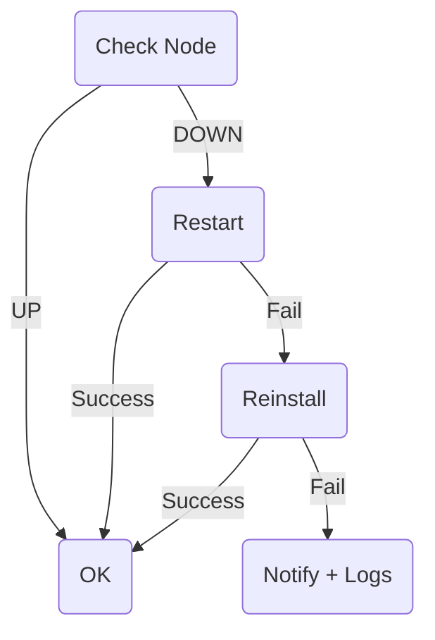

<!-- BANNER -->
<p align="center">
  
</p>

<h1 align="center">🖤 Deklan Node Bot v2.4</h1>
<p align="center">
  Telegram Control Panel + Auto-Monitor + One-Click Installer<br>
  for Gensyn RL-Swarm Nodes
</p>

<p align="center">
  
  
  
  
  
</p>

---

## 🧠 Overview

**Deklan Node Bot** = Telegram Bot untuk mengontrol dan memonitor  
**Gensyn RL-Swarm Node TANPA SSH!**

✅ Start / Stop / Restart  
✅ CPU / RAM / Disk / Uptime  
✅ Logs → Telegram  
✅ Latest Round  
✅ Auto-Monitor + Alert  
✅ Auto-Restart + Auto-Reinstall  
✅ One-Click Installer  
✅ Danger Zone (secure)  
✅ Multiple Allowed Users  
✅ AUTO_INSTALLER → update installer tanpa update bot  
✅ Anti-Spam Alert (flag cache)  

> Semua bisa jalan dari HP 📱

---

## ⚡ Features

- Telegram control
- Log viewer (journalctl)
- CPU/RAM/Disk/Uptime
- Round tracking
- Auto-monitor (systemd)
- Auto-restart
- Auto-reinstall
- UP/DOWN notifications
- Anti-Spam notification
- Remote installer scripts
- Danger Zone w/ password
- systemd integration

---

## 🚀 Quick Install

> Jalankan di VPS Ubuntu

```bash
bash <(curl -s https://raw.githubusercontent.com/deklan400/deklan-node-bot/main/install.sh)
```

Installer akan:
✅ Install dependencies  
✅ Clone repo  
✅ Setup virtualenv  
✅ Generate `.env`  
✅ Install + start bot.service  
✅ Install + start monitor.timer  

---

## ⚙️ Konfigurasi `.env`

```bash
nano /opt/deklan-node-bot/.env
```

Isi minimal:

```
BOT_TOKEN=YOUR_TOKEN
CHAT_ID=123456
```

Opsional:

```
ALLOWED_USER_IDS=12345,98765
SERVICE_NAME=gensyn
NODE_NAME=Gensyn-VPS
LOG_LINES=50
MONITOR_EVERY_MINUTES=180
ENABLE_DANGER_ZONE=1
DANGER_PASS=12345
AUTO_INSTALLER_GITHUB=https://raw.githubusercontent.com/deklan400/deklan-autoinstall/main/
```

---

### 🧩 ENV Table

| Key | Wajib | Fungsi |
|------|-------|--------|
| BOT_TOKEN | ✅ | Token bot Telegram |
| CHAT_ID | ✅ | Admin |
| ALLOWED_USER_IDS | ❌ | ID tambahan |
| SERVICE_NAME | ❌ | Target service |
| NODE_NAME | ❌ | Nama VPS |
| LOG_LINES | ❌ | Jumlah log |
| MONITOR_EVERY_MINUTES | ❌ | Interval monitor |
| ENABLE_DANGER_ZONE | ❌ | Tombol Danger |
| DANGER_PASS | ❌ | Password Danger |
| AUTO_INSTALLER_GITHUB | ✅ | Source auto installer |

---

## 📡 Telegram Commands

| Command | Fungsi |
|--------|--------|
| /start | Menu |
| /status | CPU/RAM/Disk/Uptime |
| /logs | Show logs |
| /restart | Restart node |
| /round | Show last round |
| /help | List commands |

---

## 🧩 Telegram Menu

| Button | Fungsi |
|--------|--------|
| 📊 Status | Info resource |
| 🟢 Start | Start node |
| 🔴 Stop | Stop node |
| 🔁 Restart | Restart |
| 📜 Logs | Tampilkan logs |
| ℹ️ Round | Last round |
| 🧩 Installer | Menu installer |
| ⚠ Danger Zone | Tools berbahaya |

---

## 🔧 Installer Menu

Remote script loaded via:
```
AUTO_INSTALLER_GITHUB
```

Tombol:
- Install
- Reinstall
- Update
- Uninstall

Flow:
1) Klik tombol
2) Bot konfirmasi
3) Ketik `YES`

---

## ⚙️ Auto Installer (AUTO_REPO)

Semua installer berasal dari:

```
https://github.com/deklan400/deklan-autoinstall
```

✅ Bisa update build → tanpa update bot  

Supports:
- install.sh
- reinstall.sh
- update.sh
- uninstall.sh

---

## 🛰 Auto Monitor

Timer systemd:
- Cek node
- Auto-restart
- Jika gagal → auto-reinstall
- Jika masih gagal → kirim logs

```
systemctl status monitor.timer
```

---

### 🔁 Auto-Recovery Logic

1) Cek service  
2) Restart  
3) Kalau masih DOWN → reinstall  
4) Kalau masih DOWN → notif + logs  



---

## 🧠 Anti-Spam

Cache status disimpan di:

```
/tmp/.node_status.json
```

➜ notif hanya keluar kalau status berubah  
(UP → DOWN / DOWN → UP)

---

## 🔥 Danger Zone

> Wajib ENABLE + isi DANGER_PASS

| Fungsi |
|--------|
| Remove RL-Swarm |
| Clean Docker |
| Remove Swap |
| Full Clean |
| Reboot VPS |

---

## 🔥 Systemd

### Bot
```
systemctl status bot
journalctl -u bot -f
```

### Monitor
```
systemctl status monitor.timer
systemctl start monitor.service
```

---

## 📁 Repo Structure

```
/opt/deklan-node-bot
├── bot.py
├── monitor.py
├── install.sh
├── requirements.txt
├── bot.service
├── monitor.service
├── monitor.timer
├── .env
├── .env.example
└── /tmp/.node_status.json   ← auto created
```

---

## ✅ Sample Alerts

✅ Node OK
```
✅ Gensyn-01 is UP
CPU 32% • RAM 71% • Disk 62%
Last round: xxx
```

🚨 DOWN
```
🚨 Gensyn-01 DOWN — Restarting…
```

🟢 Recovered
```
🟢 Recovered after restart
```

🔁 Recovered after reinstall
```
✅ Recovered after reinstall
```

❌ FAILED
```
❌ FAILED — manual fix required
<logs>
```

---

## 🗑 Uninstall

```
systemctl stop bot monitor.service monitor.timer
systemctl disable bot monitor.service monitor.timer
rm -f /etc/systemd/system/bot.service
rm -f /etc/systemd/system/monitor.*
rm -rf /opt/deklan-node-bot
systemctl daemon-reload
```

---

## 🛣 Roadmap

- Multi-node
- Web dashboard
- Auto update bot
- Resource alert
- Gensyn identity tools

---

## ❤️ Credits
Built with ❤️ by **Deklan + GPT-5**
