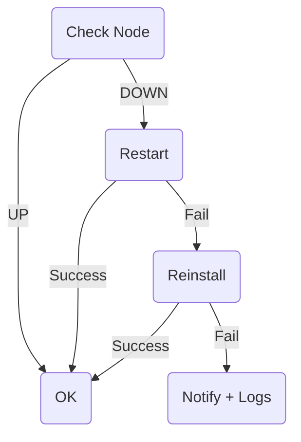

<START>

<!-- BANNER -->
<p align="center">
  
</p>

<h1 align="center">🖤 Deklan Node Bot v2.4</h1>
<p align="center">
  Telegram Control Panel + Auto-Monitor + One-Click Installer<br>
  for Gensyn RL-Swarm Nodes
</p>

<p align="center">
  
  
  
  
  
</p>

---

## 🧠 Overview

**Deklan Node Bot** → Telegram Bot untuk mengontrol & monitoring  
**Gensyn RL-Swarm Node tanpa SSH!**

✅ Start / Stop / Restart  
✅ CPU / RAM / Disk / Uptime  
✅ Logs → Telegram  
✅ Latest Round  
✅ Auto-Monitor + Auto-Restart  
✅ Auto-Reinstall  
✅ One-Click Installer  
✅ Danger Zone (Password)  
✅ Multi Admin  
✅ Remote Auto-Installer  
✅ Anti-Spam Alert  

> Semua kontrol via Telegram — HP aja cukup 📱

---

## ⚡ Features

- Telegram menu
- Systemd integration
- Log viewer (journalctl)
- CPU / RAM / Disk Monitor
- Round detection
- Auto-monitor
- Auto-restart
- Auto-reinstall
- UP/DOWN notification
- Anti-Spam (no alert repeat)
- Remote installer script
- Multi admin
- Danger Zone (secure)

---

## 🚀 Quick Install

> Jalankan di VPS Ubuntu

```bash
bash <(curl -s https://raw.githubusercontent.com/deklan400/deklan-node-bot/main/install.sh)
```

Installer akan:
✅ Install dependencies  
✅ Clone repo  
✅ Setup virtualenv  
✅ Generate `.env` via prompt  
✅ Install + start bot.service  
✅ Install + start monitor.timer  

---

## ✅ Example — Telegram Menu

<p align="center">
  
</p>

---

## 📜 Logs Example

<p align="center">
  
</p>

---

## 💾 Swap Manager

<p align="center">
  
</p>

---

## ⚙️ Konfigurasi `.env`

```bash
nano /opt/deklan-node-bot/.env
```

Minimal:

```
BOT_TOKEN=YOUR_TOKEN
CHAT_ID=123456
```

Opsional:

```
ALLOWED_USER_IDS=12345,98765
SERVICE_NAME=gensyn
NODE_NAME=Gensyn-VPS
LOG_LINES=80
MONITOR_EVERY_MINUTES=180
ENABLE_DANGER_ZONE=1
DANGER_PASS=12345
AUTO_INSTALLER_GITHUB=https://raw.githubusercontent.com/deklan400/deklan-autoinstall/main/
```

---

### 🧩 ENV Table

| Key | Wajib | Fungsi |
|------|-------|--------|
| BOT_TOKEN | ✅ | Token bot Telegram |
| CHAT_ID | ✅ | Admin |
| ALLOWED_USER_IDS | ❌ | Extra admins |
| SERVICE_NAME | ❌ | Target systemd service |
| NODE_NAME | ❌ | Label VPS |
| LOG_LINES | ❌ | Baris log |
| MONITOR_EVERY_MINUTES | ❌ | Interval monitor |
| ENABLE_DANGER_ZONE | ❌ | Mode bahaya |
| DANGER_PASS | ❌ | Password Danger |
| AUTO_INSTALLER_GITHUB | ✅ | Source auto installer |

---

## 📡 Telegram Commands

| Command | Fungsi |
|--------|--------|
| /start | Menu |
| /status | Info resource |
| /logs | Show logs |
| /restart | Restart node |
| /round | Last round |
| /help | Bantuan |

---

## 🧩 Menu Detail

| Button | Fungsi |
|--------|--------|
| 📊 Status | Info VPS |
| 🟢 Start | Start node |
| 🔴 Stop | Stop node |
| 🔁 Restart | Restart |
| 📜 Logs | Lihat logs |
| ℹ️ Round | Last round |
| 💾 Swap Manager | Manage SWAP |
| 🧩 Installer | Menu installer |
| ⚠ Danger Zone | Tools Bahaya |

---

## 💾 Swap Manager

✅ 16GB  
✅ 32GB  
✅ 64GB  
✅ Custom input  
✅ Auto update `/etc/fstab`

> No reboot needed ✅

---

## 🔧 Installer Menu

Remote installer:

```
AUTO_INSTALLER_GITHUB
```

Fitur:
- Install
- Reinstall
- Update
- Uninstall

Flow:
1) Klik tombol  
2) Bot konfirmasi → YES  
3) Bot eksekusi script  

---

## 🛰 Auto Monitor

Systemd timer akan:
✅ Cek status node  
✅ Auto-restart  
✅ Jika gagal → auto-reinstall  
✅ Jika masih fail → kirim logs  

```
systemctl status monitor.timer
```

---

### 🔁 Auto-Recovery Logic



---

## 🔥 Danger Zone

> ENABLE_DANGER_ZONE=1 + DANGER_PASS wajib

| Fungsi |
|--------|
| Remove RL-Swarm |
| Clean Docker |
| Remove Swap |
| Full Clean |
| Reboot VPS |

---

## 🔥 Systemd Reference

### Bot
```
systemctl status bot
journalctl -u bot -f
```

### Monitor
```
systemctl status monitor.timer
systemctl start monitor.service
```

---

## 📁 Folder Structure

```
/opt/deklan-node-bot
├── bot.py
├── monitor.py
├── install.sh
├── requirements.txt
├── bot.service
├── monitor.service
├── monitor.timer
├── .env
├── .env.example
└── /tmp/.node_status.json   ← auto
```

---

## ✅ Sample Alerts

✅ UP
```
✅ Node UP
CPU 32% • RAM 71% • Disk 62%
Round: Join X
```

🚨 DOWN
```
🚨 Node DOWN — Restarting…
```

🟢 RECOVER
```
🟢 Recovered after restart
```

✅ REINSTALLED
```
✅ Fix via reinstall OK
```

❌ FAIL
```
❌ Failed — needs manual fix
<logs>
```

---

## 🗑 Uninstall

```
systemctl stop bot monitor.service monitor.timer
systemctl disable bot monitor.service monitor.timer
rm -f /etc/systemd/system/bot.service
rm -f /etc/systemd/system/monitor.*
rm -rf /opt/deklan-node-bot
systemctl daemon-reload
```

---

## 🛣 Roadmap

- Multi-node support
- Web dashboard
- Auto update bot
- Resource alert
- Identity helper tools

---

## ❤️ Credits
Built with ❤️ by **Deklan × GPT-5**

<END>
