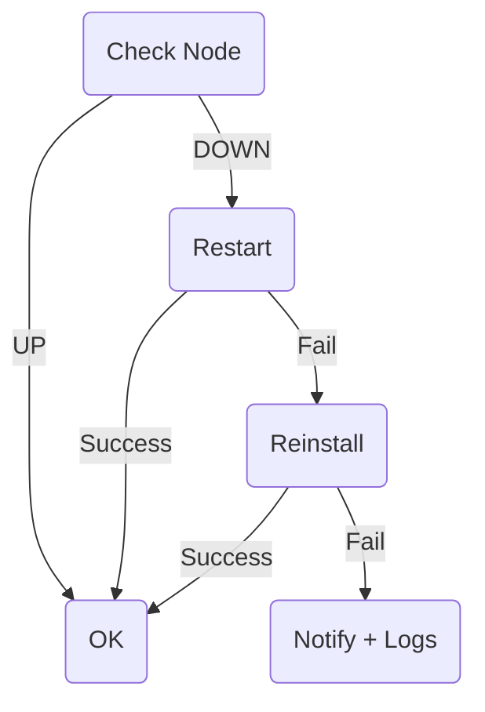

<START>

<!-- HEADER -->
<p align="center">
  
</p>

<h1 align="center">⚡ Deklan Node Bot — v3.6</h1>

<p align="center">
  <b>Telegram Control Panel + Auto-Monitor + Swap Manager + One-Click Installer</b>
</p>

<p align="center">
  
  
  
  
  
</p>

---

# 🧠 Overview

**Deklan Node Bot** = Telegram bot untuk mengontrol & monitoring  
**Gensyn RL-Swarm Node TANPA SSH**

✅ Start / Stop / Restart  
✅ Logs → Telegram  
✅ Latest Round  
✅ CPU / RAM / Disk / Uptime  
✅ Auto Monitor + Auto Restart  
✅ Auto Reinstall  
✅ Swap Manager  
✅ One-Click Installer  
✅ Danger Zone (Password)  
✅ Multi Admin  
✅ Anti-Spam (status cache)  

> Semua cukup dari Telegram ‼ 📱

---

# 🖼️ Screenshots (Dark Mode)

### 🏁 Main Menu
<p align="center">
  
</p>

---

### 📊 Status Example
<p align="center">
  
</p>

---

### 📜 Logs Example
<p align="center">
  
</p>

---

### 💾 Swap Manager
<p align="center">
  
</p>

> Kalau kamu ada real screenshot → tinggal ganti url-nya.

---

# ⚡ Features

- Interactive Telegram panel
- Log viewer (journalctl)
- CPU / RAM / Disk / Round monitor
- Auto restart
- Auto reinstall
- Swap manager
- Multi admin
- No spam UP/DOWN
- Danger zone (secured)
- Remote installer
- Smart key auto-link

---

# 🚀 Quick Install

Jalankan di VPS Ubuntu:

```bash
bash <(curl -s https://raw.githubusercontent.com/deklan400/deklan-node-bot/main/install.sh)
```

Installer otomatis:
✅ Install dependencies  
✅ Clone repo  
✅ Setup venv  
✅ Prompt BOT_TOKEN / CHAT_ID  
✅ Generate .env  
✅ Install + start bot.service  
✅ Install + start monitor.timer  

> 0 config manual ✅

---

# ⚙️ ENV (.env)

Installer akan generate otomatis via prompt.

Lokasi file:
```
/opt/deklan-node-bot/.env
```

Minimal isi:
```
BOT_TOKEN=xxxxx
CHAT_ID=111111
```

---

# 🧩 ENV Table

| Key | Wajib | Fungsi |
|------|-------|------|
| BOT_TOKEN | ✅ | Token bot |
| CHAT_ID | ✅ | Admin utama |
| ALLOWED_USER_IDS | ❌ | Extra admin |
| SERVICE_NAME | ❌ | Target service |
| NODE_NAME | ❌ | Nama VPS |
| RL_DIR | ✅ | Base RL |
| KEY_DIR | ✅ | Identity |
| LOG_LINES | ❌ | Log row |
| LOG_MAX_CHARS | ❌ | Limit Tg |
| MONITOR_EVERY_MINUTES | ❌ | Interval |
| ENABLE_DANGER_ZONE | ❌ | Aktifkan menu danger |
| DANGER_PASS | ❌ | Password menu danger |
| AUTO_INSTALLER_GITHUB | ✅ | Remote source |

---

# 🤖 Telegram Commands

| Command | Fungsi |
|--------|--------|
| /start | Menu |
| /status | VPS stats |
| /logs | Show logs |
| /restart | Restart node |
| /round | Show last round |
| /help | Help |

---

# 🧩 Telegram Menu

| Button | Fungsi |
|--------|--------|
| 📊 Status | Info node |
| 🟢 Start | Start |
| 🔴 Stop | Stop |
| 🔁 Restart | Restart |
| 📜 Logs | Lihat logs |
| ℹ️ Round | Info round |
| 💾 Swap Manager | Set 16/32/64/custom |
| 🧩 Installer | Install/update |
| ⚠ Danger Zone | Advanced |

---

# 💾 Swap Manager

Menu:
- 16G
- 32G
- 64G
- Custom

Example custom:
```
48 → swap = 48GB
```

---

# 🔧 Installer Menu

Script akan fetch dari:
```
AUTO_INSTALLER_GITHUB
```

Mode:
- Install
- Update
- Reinstall
- Uninstall

Flow:
1) Klik tombol  
2) Bot minta confirm  
3) Balas `YES` ✅  

---

# 🛰 Auto Monitor

Systemd timer → check:
- Node alive?
- Restart if down
- Reinstall if restart failed
- Notify + Log on final fail

Check:
```
systemctl status monitor.timer
```

---

# 🔁 Auto-Recovery Logic



---

# ⚠ Danger Zone

> ENABLE_DANGER_ZONE=1 + DANGER_PASS wajib

| Fungsi |
|--------|
| Remove RL-Swarm |
| Clean Docker |
| Delete Swap |
| Full Clean |
| Reboot VPS |

⚠ Expert only

---

# 🔥 Systemd Cheatsheet

### Bot
```
systemctl status bot
journalctl -u bot -f
```

### Monitor
```
systemctl status monitor.timer
systemctl start monitor.service
```

---

# 📁 Repo Structure

```
/opt/deklan-node-bot
├── bot.py
├── monitor.py
├── install.sh
├── requirements.txt
├── bot.service
├── monitor.service
├── monitor.timer
├── .env
├── .env.example
└── /tmp/.node_status.json
```

---

# ✅ Sample Alerts

✅ UP
```
✅ Node UP
CPU 23% • RAM 68% • Disk 50%
Round: Join X
```

🚨 DOWN
```
🚨 DOWN — Restarting…
```

🟢 After Restart
```
🟢 Recovered!
```

🔁 After Reinstall
```
✅ Recovered after reinstall
```

❌ FAILED
```
❌ FAILED — manual fix needed
<logs>
```

---

# 🗑 Uninstall

```
systemctl stop bot monitor.service monitor.timer
systemctl disable bot monitor.service monitor.timer
rm -f /etc/systemd/system/bot.service
rm -f /etc/systemd/system/monitor.*
rm -rf /opt/deklan-node-bot
systemctl daemon-reload
```

---

# 🛣 Roadmap

- Multi-node support
- WebUI dashboard
- Auto update bot
- Resource alert
- Identity tools

---

<h3 align="center">Built with ❤️ by <b>Deklan × GPT-5</b></h3>

<END>
